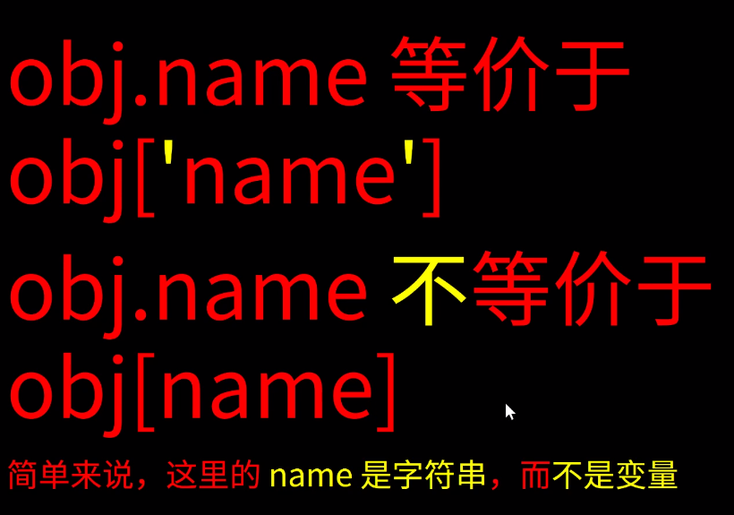
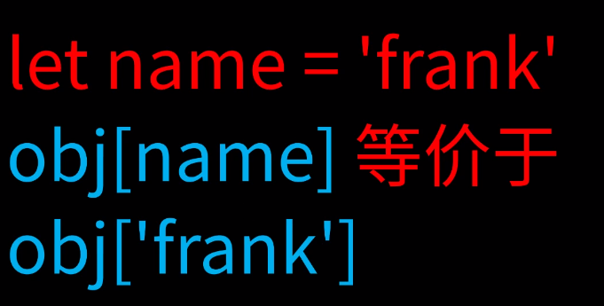
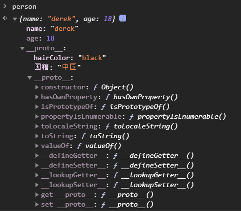

# object

## 一、基本

- 唯一一种复杂类型

1. 定义
   1. 无序的数据集合
   2. 键值对的集合
2. 写法

```javascript
let obj = {'name': 'frank', 'age': 18 }
//常用写法
let obj = new Object({'name': 'frank'})
//正规写法
console.log({'name'; 'frank', 'age': 18})
//
```

3. 细节

   1. 键名必须是**字符串**，不是标识符，可以包含任意字符
   2. 引号是可以省略的，省略之后就只能写标识符（除了数字）
   3. **就算引号省略了，键名也还是字符串**
   4. **加引号没毛病**

4. 属性名：属性值
   property: value

5. Object.keys(obj) 可以得到 obj 的所有 key

6. 用变量值作为 key

- 不加[]会变成字符串

```javascript
let a = 'xxx';
let obj = {
    [a]: 111;
}
```

    则 obj = {'xxx': 111}

7. symbol 也可以做属性名 （超纲知识：基本不用）

```javascript
let a = Symbol();
let obj = { [a]: "Hello" };
```

8. 奇怪的属性名

```javascript
let obj = {
  1e2: true,
  1e-2: true,
  0xff: true,
};
```

obj = {100: true, 0.01: true, 255: true}

9. obj 隐藏属性

- 每个对象都有
- \_\_proto\_\_
- 指向原型

## 二、原型

- 每个对象都有原型
  1. 原型里存着对象的公有属性
  2. 比如 obj 的原型就是一个对象
  3. obj.\_\_proto\_\_存着这个对象的地址
  4. 这个对象里有 toString/constructor/valueOf 等属性
- 对象的原型也是对象
  1. 所以对象的原型也有原型
  2. obj = {} 的原型即为所有对象的原型
  3. 这个原型包含所有对象的共有属性，是对象的根  
     （原型的原型是对象的根）
  4. 这个原型也有原型，是 null

## 三、obj 属性的增删改查

### 删

1. delete obj.name / delete obj['name']
   - 属性名: 属性值 全删除
2. obj.name = undefined
   - 只删属性值，属性名还在（赋值行为）
3. 查看 obj 里是否有某属性：  
   'xxx' in obj （属性名记得加引号）
   - true 有'xxx'属性
   - false 没有'xxx'属性
4. 含有属性名，但值为 undefined
   'xxx' in obj && obj.xxx === undefined

### 查

1. 查看 obj 自身所有属性
   - Object.keys(obj)
   - Object.value(obj)
   - Object.entries(obj)  
     key 和 value 都返回
2. 查看公有属性
   - console.dir(obj)
   - obj.\_\_proto\_\_ （不推荐）
3. 判断一个是否有一个属性
   - 'name' in obj // true/false  
      对象本身和原型上有的属性都返回 true
   - obj.hasOwnProperty('toString')  
      只有对象本身有的属性才返回 true
4. 查看一个属性

   - obj['key'] **优先使用这种**
   - obj.key
   - obj[key]  
      []里的 key 不是'key'，而是一个变量，先求变量值

   
     
   _图片来自杭州饥人谷教程_

### 修改或增加属性

1.  直接赋值

    - let obj = {name: 'derek'}
    - obj.name = 'derek'
    - obj['name'] = 'derek'
    - obj['na' + 'me'] = 'derek'
    - let key = 'name'; obj[key] = 'derek'

2.  批量赋值

    - Object.assign(obj, {age: 18, gender: 'male'})

3.  修改或增加共有属性

    - 无法通过自身修改或增加共有属性
      obj.toString = 'xxx'; 只能修改自身属性
    - 我偏要修改或增加原型上的属性
      ```javascript
      obj.__proto__.toString = "xxx";
      //或
      window.Object.prototype.toString = "yyy";
      ```
      一般来说，不要修改原型，会引起很多问题

4.  原型链
    给对象加自定义的原型  
    以 common 为原型创建对象 person：

    ```javascript
    let common = {
      国籍: "中国",
      hairColor: "black",
    };
    let person = Object.create(common, { age: { value: 18 } });
    person.name = "derek";
    ```

    

    - 修改对象原型推荐这种方法
    - 要改一开始就改，别后来再改

5.  所有\_\_proto\_\_都不推荐
